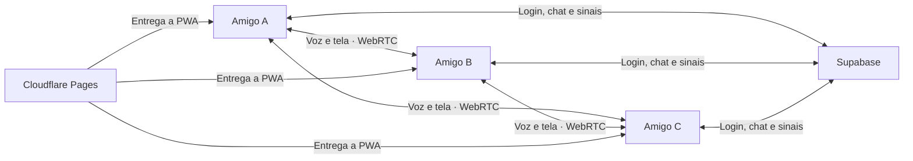

<div align="center">
  
  <h1>Covil</h1>
  <p><strong>Entre. Fale. Jogue.</strong></p>
  <p>Um espaço privado de voz, mensagens e compartilhamento de tela para grupos pequenos.</p>

  [](https://github.com/Rafael-Tunes-Mathiensen/Covil/actions/workflows/ci.yml)
  
  
</div>

---

O Covil é uma PWA desktop-first criada para grupos de duas a quatro pessoas. O frontend roda no navegador, Supabase cuida de autenticação e chat, e WebRTC conecta os participantes diretamente para voz e tela compartilhada.

O projeto abre em **modo de demonstração** quando não encontra credenciais do Supabase. Isso permite explorar a interface, enviar mensagens locais e testar o próprio microfone ou tela antes de configurar qualquer serviço externo.

## O que já funciona

- identidade visual responsiva e instalável como PWA;
- cadastro e login por e-mail com Supabase Auth;
- criação de grupo privado e entrada por convite de uso único;
- canais de texto com histórico e atualização em tempo real;
- sala de voz mesh para até quatro participantes;
- mute, limpeza de mídia e recuperação básica de conexão;
- compartilhamento de tela em 720p/30 fps;
- políticas RLS e funções seguras no PostgreSQL;
- modo de demonstração sem conta ou backend;
- testes, lint, build e CI no GitHub Actions.

## Começar em dois minutos

Requisitos: Node.js 22 ou superior e npm.

```bash
git clone https://github.com/Rafael-Tunes-Mathiensen/Covil.git
cd covil
npm install
npm run dev
```

Abra o endereço mostrado pelo Vite. Sem `.env.local`, a interface usa dados locais de demonstração.

### Conectar ao Supabase

1. Copie `.env.example` para `.env.local`.
2. Preencha `VITE_SUPABASE_URL` e `VITE_SUPABASE_ANON_KEY`.
3. Execute a migration [`supabase/migrations/202607190001_initial.sql`](supabase/migrations/202607190001_initial.sql) no SQL Editor do Supabase.
4. Reinicie `npm run dev`.

```env
VITE_SUPABASE_URL=https://seu-projeto.supabase.co
VITE_SUPABASE_ANON_KEY=sua-chave-publica-anon
VITE_ICE_SERVERS=stun:stun.l.google.com:19302
```

> Não coloque `service_role`, senha do banco ou credenciais TURN permanentes em variáveis `VITE_*`. Tudo que começa com `VITE_` é incluído no bundle público.

## Como funciona



Áudio e vídeo não passam pelo banco. Cada navegador envia sua mídia diretamente aos outros participantes. Essa abordagem reduz custo e é adequada ao limite pequeno do projeto. Algumas redes restritivas ainda exigirão um servidor TURN.

Leia a [arquitetura completa](docs/ARCHITECTURE.md) para conhecer as fronteiras e decisões do MVP.

## Organização

```text
covil/
├── .github/workflows/       # integração contínua
├── docs/                    # design, arquitetura e publicação
├── public/                  # ícone e recursos estáticos
├── src/
│   ├── components/          # superfícies da interface
│   ├── data/                # conteúdo de demonstração
│   ├── features/
│   │   ├── auth/            # sessão e acesso
│   │   ├── covil/           # grupos, canais e chat
│   │   ├── onboarding/      # criação e convite
│   │   └── voice/           # WebRTC e sinalização
│   ├── lib/                 # configuração e utilitários
│   ├── styles/              # sistema visual
│   └── types/               # modelo de domínio
└── supabase/migrations/     # banco e autorização
```

## Comandos

| Comando | Resultado |
| --- | --- |
| `npm run dev` | inicia o ambiente local com recarregamento |
| `npm run lint` | verifica padrões e problemas estáticos |
| `npm test` | executa os testes uma vez |
| `npm run test:watch` | acompanha os testes durante o desenvolvimento |
| `npm run build` | valida TypeScript e gera `dist/` |
| `npm run preview` | abre localmente a versão gerada |

## Documentação

- [Direção visual](docs/DESIGN.md)
- [Arquitetura](docs/ARCHITECTURE.md)
- [Configuração do Supabase](docs/SUPABASE.md)
- [Publicação gratuita](docs/DEPLOYMENT.md)
- [Política de segurança](SECURITY.md)

## Estado e próximos passos

Esta é a fundação funcional do MVP. A interface e o modo local estão prontos; a integração real precisa ser validada em um projeto Supabase e em duas redes diferentes.

- [x] Chat, autenticação e grupos privados
- [x] Motor WebRTC mesh e compartilhamento de tela
- [x] PWA, documentação e CI
- [ ] Teste ponta a ponta com quatro contas reais
- [ ] Credenciais TURN efêmeras para redes restritas
- [ ] Seleção de dispositivos e volume individual
- [ ] Notificações e indicador real de quem está falando
- [ ] Aplicativo desktop para push-to-talk global

## Licença

Distribuído sob a licença [MIT](LICENSE).
