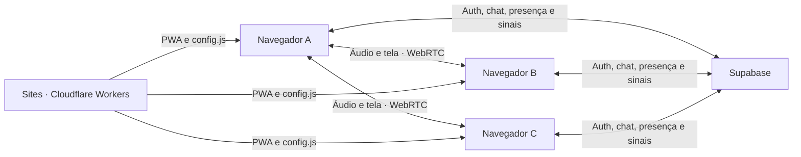

# Arquitetura

O Covil separa dados persistentes e mídia em tempo real. Supabase recebe autenticação, mensagens, autorização, estado de moderação e pequenos sinais de negociação. Voz e compartilhamento de tela trafegam diretamente entre os participantes por WebRTC.

## Camadas

| Camada | Responsabilidade |
| --- | --- |
| `src/components` | Interface e composição visual |
| `src/features/admin` | Console do proprietário, acessos e métricas operacionais |
| `src/features/auth` | Sessão e acesso por e-mail |
| `src/features/covil` | Grupo, canais, cargos, permissões, membros e mensagens |
| `src/features/sound` | Efeitos sonoros sintetizados e preferência local |
| `src/features/voice` | WebRTC, detecção local de fala e transporte de sinalização |
| `src/lib` | Configuração, Supabase e funções puras |
| `worker` | Entrega da SPA e configuração pública em tempo de execução |
| `supabase/migrations` | Modelo, RPCs, RLS e Realtime |

## Entrega e configuração

O `@cloudflare/vite-plugin` lê `wrangler.jsonc` e gera a PWA em `dist/client` e
o Worker em `dist/server/index.js`. Recursos comuns são entregues pelo binding
`ASSETS`, com fallback de SPA para as rotas do frontend. A exceção é
`/config.js`, gerado dinamicamente e sem cache pelo Worker.

Essa rota transforma `SUPABASE_URL`, `SUPABASE_ANON_KEY` e `ICE_SERVERS` do
ambiente do Sites em configuração pública para o navegador. No desenvolvimento,
`src/lib/config.ts` mantém compatibilidade com `VITE_SUPABASE_URL`,
`VITE_SUPABASE_ANON_KEY` e `VITE_ICE_SERVERS` de `.env.local`. Nenhum desses
locais é adequado para `service_role`, senha do banco ou outro segredo de
servidor.

## Chamada de voz

Cada participante mantém até cinco `RTCPeerConnection`, uma para cada amigo. Essa malha é adequada ao limite planejado de seis pessoas e evita um servidor de mídia. O hook `useVoiceRoom` administra:

- permissão e ciclo de vida do microfone;
- perfect negotiation para evitar colisão de ofertas;
- candidatos ICE, tolerância breve a desconexão, ICE restart e recriação do peer que continuar falho;
- reprodução de áudio remoto;
- publicação e remoção da tela compartilhada;
- detecção de fala por volume com Web Audio, sem gravar ou enviar amostras de áudio;
- coleta local de bytes, bitrate, latência, jitter, perda e tipo de rota ICE, sem exibir endereços IP;
- encerramento de tracks, peers e assinaturas.

O transporte `SupabaseVoiceTransport` separa dois tópicos privados. `voice:<channel_uuid>` recebe Broadcast SDP/ICE; o cliente oficial assina esse tópico somente enquanto participa da chamada. `voice-presence:<channel_uuid>` mantém o roster: observadores assinam sem `track`, enquanto quem entra publica sua presença. As duas superfícies compartilham uma única assinatura de Presence por sala, republicam o participante após reconexão e têm policies por membership e extensão em `realtime.messages`.

Cada entrada recebe um `sessionId`. Sinais de uma sessão anterior são descartados; sinais que chegam antes do snapshot de Presence só são processados se a Presence sincronizar em até 15 segundos, com fila limitada a seis emissores e 64 itens por emissor. Cada peer aceita até 128 sinais pendentes e 64 candidatos ICE anteriores à descrição remota. Observadores repetem falhas iniciais com backoff entre 1 e 30 segundos; ações de Presence tentam até três vezes.

Os servidores ICE podem ser configurados como URLs STUN/TURN separadas por vírgula ou como um array JSON completo de `RTCIceServer`, inclusive com `username` e `credential`. O padrão atual usa somente STUN. Recuperação ICE não cria uma rota de relay: redes sem caminho P2P direto precisam de TURN com credenciais efêmeras. Segredos permanentes nunca devem entrar no bundle nem em `/config.js`.

Cada canal de voz usa uma sala independente. Selecionar outra sala apenas mostra seus ocupantes e mantém a chamada atual no dock. A ação **Entrar nesta sala** encerra peers, tracks e assinaturas da chamada anterior antes de iniciar a nova. O indicador de fala analisa localmente os streams com `AnalyserNode` e RMS; apenas o estado visual transitório permanece em memória.

### Moderação cooperativa

`moderate_covil_voice()` valida a permissão no banco e persiste `server_muted` ou um pedido de desconexão por canal e usuário. O Realtime entrega essa mudança e o cliente alvo desativa o microfone ou sai da sala. O estado de mute continua válido ao reconectar; `unmute` apenas libera essa restrição.

Como a chamada é P2P e não existe SFU controlando a mídia, essa moderação depende de um cliente íntegro. Um cliente adulterado pode ignorar o estado recebido ou estabelecer outra conexão. Portanto, o recurso oferece controle confiável para os navegadores oficiais, não uma garantia contra participantes maliciosos.

## Dados e autorização

O banco usa `auth.uid()` como identidade. RLS limita cada leitura ao Covil do usuário, e RPCs `SECURITY DEFINER` concentram as escritas que exigem autorização, validação ou trava transacional. `create_covil` e `join_covil_by_invite` cuidam do ciclo de entrada; o código de convite tem 128 bits, só pode ser consultado pelo owner e é substituído atomicamente quando alguém entra.

O owner possui implicitamente `manage_channels`, `moderate_voice` e `remove_members`. Membros podem acumular cargos; sua permissão efetiva é a união das permissões de todos eles. Somente o owner cria, exclui ou atribui cargos, até o limite de 12. A criação de canais passa por `create_covil_channel()`, aceita owner ou cargo com `manage_channels` e serializa a contagem para não ultrapassar 25 canais. Remoção de membro e moderação de voz também passam por RPCs, com proteção para o fundador.

O limite de seis membros é garantido por trigger com trava na linha do Covil, não apenas pela interface. A allowlist `private.app_admins` concede ao proprietário funções administrativas autenticadas para consultar contas, memberships e métricas agregadas, além de remover membros comuns. Essas funções não concedem leitura global do conteúdo de `messages`.

Consulte [SUPABASE.md](./SUPABASE.md) para a matriz de autorização e os passos de configuração.

## Limites deliberados do MVP

- um Covil ativo por usuário na interface;
- até 25 canais de texto e voz e 12 cargos por Covil;
- malha WebRTC para até seis participantes;
- ausência de SFU e configuração padrão somente com STUN, sem TURN gerenciado nesta etapa;
- moderação de voz cooperativa, sem garantia contra cliente adulterado;
- remoção de membro não revoga uma conexão P2P já estabelecida até a sala ser reiniciada;
- sem upload de arquivos, câmera ou gravação.
