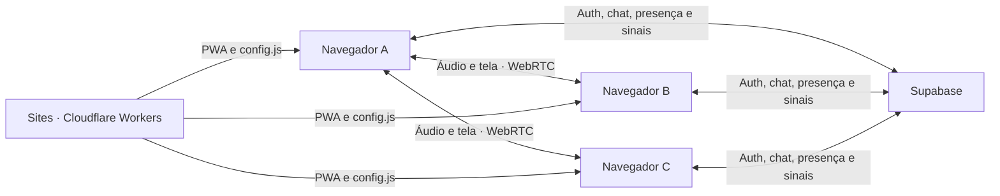

# Arquitetura

O Covil separa dados persistentes e mídia em tempo real. Supabase recebe apenas autenticação, mensagens e pequenos sinais de negociação. Voz e compartilhamento de tela trafegam diretamente entre os participantes por WebRTC.

## Camadas

| Camada | Responsabilidade |
| --- | --- |
| `src/components` | Interface e composição visual |
| `src/features/auth` | Sessão e acesso por e-mail |
| `src/features/covil` | Grupo, canais, membros e mensagens |
| `src/features/voice` | WebRTC e transporte de sinalização |
| `src/lib` | Configuração, Supabase e funções puras |
| `worker` | Entrega da SPA e configuração pública em tempo de execução |
| `supabase/migrations` | Modelo, RPCs, RLS e Realtime |

## Entrega e configuração

O `@cloudflare/vite-plugin` lê `wrangler.jsonc` e gera a PWA em `dist/client` e
o Worker em `dist/server/index.js`. Recursos comuns são entregues pelo binding
`ASSETS`, com fallback de SPA para as rotas do frontend. A exceção é
`/config.js`, gerado dinamicamente e sem cache pelo Worker.

Essa rota transforma `SUPABASE_URL`, `SUPABASE_ANON_KEY` e `ICE_SERVERS` do
ambiente do Sites em configuração pública para o navegador. No desenvolvimento,
`src/lib/config.ts` mantém compatibilidade com `VITE_SUPABASE_URL`,
`VITE_SUPABASE_ANON_KEY` e `VITE_ICE_SERVERS` de `.env.local`. Nenhum desses
locais é adequado para `service_role`, senha do banco ou outro segredo de
servidor.

## Chamada de voz

Cada participante mantém até três `RTCPeerConnection`, uma para cada amigo. Essa malha é adequada ao limite planejado de quatro pessoas e evita um servidor de mídia. O hook `useVoiceRoom` administra:

- permissão e ciclo de vida do microfone;
- perfect negotiation para evitar colisão de ofertas;
- candidatos ICE e uma tentativa de ICE restart;
- reprodução de áudio remoto;
- publicação e remoção da tela compartilhada;
- encerramento de tracks, peers e assinaturas.

O transporte `SupabaseVoiceTransport` usa um canal privado: Broadcast para sinais e Presence para anunciar participantes. Políticas em `realtime.messages` verificam se a pessoa pertence ao Covil correspondente antes de autorizar leitura ou escrita. Os servidores ICE podem ser configurados como URLs STUN/TURN separadas por vírgula ou como um array JSON completo de `RTCIceServer`, inclusive com `username` e `credential`. TURN deve usar credenciais efêmeras; segredos permanentes nunca devem entrar no bundle nem em `/config.js`.

## Dados e autorização

O banco usa `auth.uid()` como identidade. RLS permite leitura e escrita somente entre membros do mesmo Covil. As RPCs `create_covil` e `join_covil_by_invite` concentram as operações que atravessam mais de uma tabela. O código de convite tem 128 bits, só pode ser consultado pelo owner e é substituído atomicamente quando alguém entra. O owner também pode renová-lo manualmente.

Consulte [SUPABASE.md](./SUPABASE.md) para a matriz de autorização e os passos de configuração.

## Limites deliberados do MVP

- um Covil ativo por usuário na interface;
- um canal de voz padrão;
- malha WebRTC para até quatro participantes;
- ausência de TURN gerenciado nesta etapa;
- remoção de membro não revoga uma conexão P2P já estabelecida até a sala ser reiniciada;
- sem upload de arquivos, câmera, gravação ou moderação avançada.
